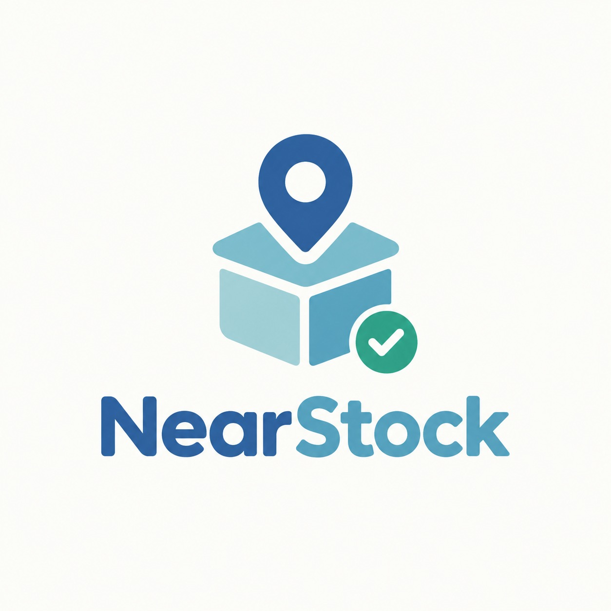
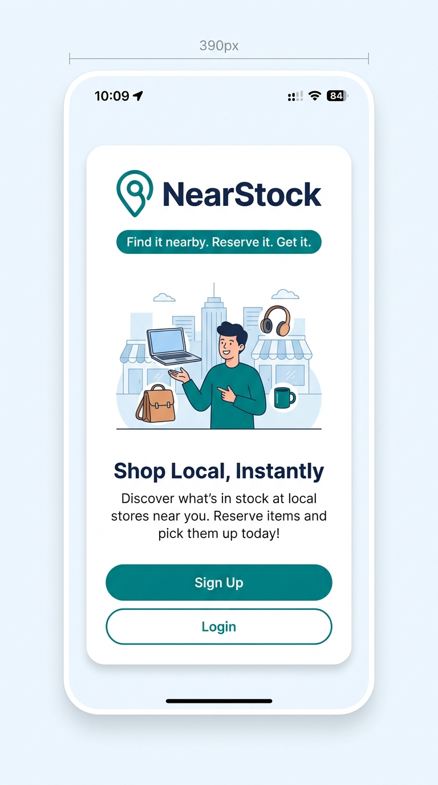
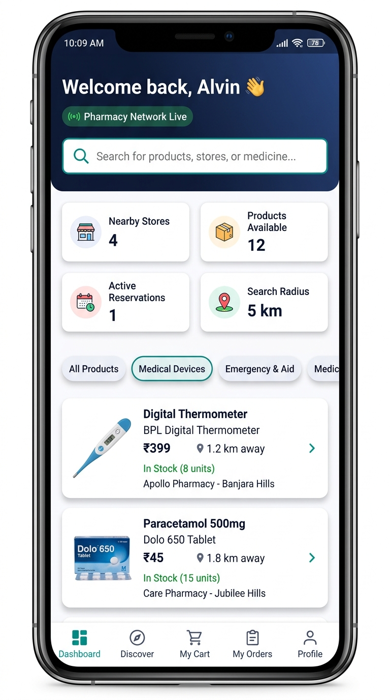
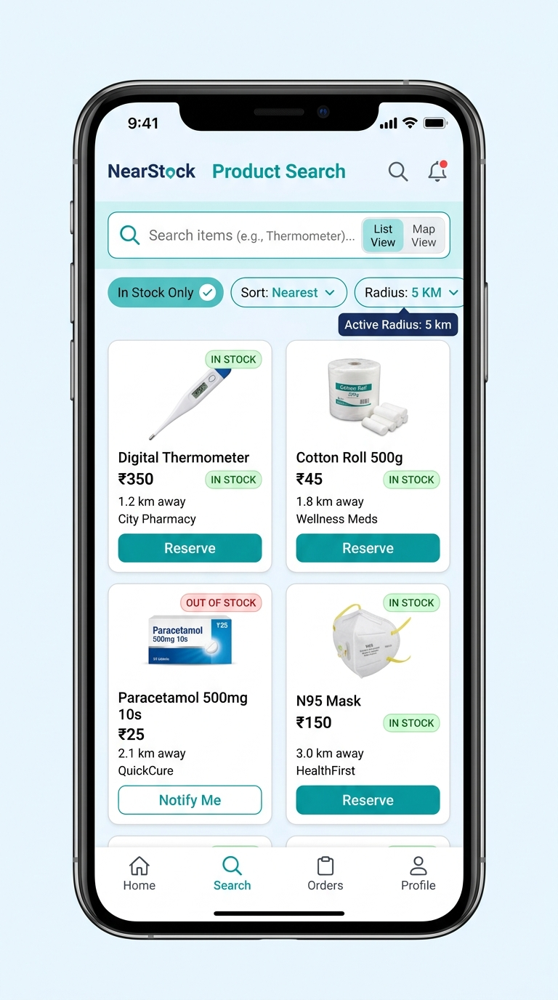
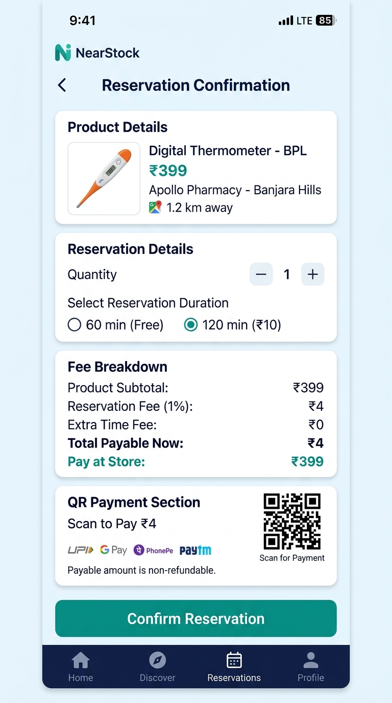
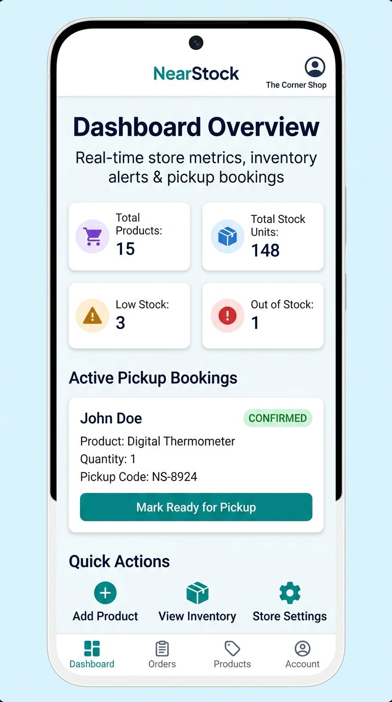
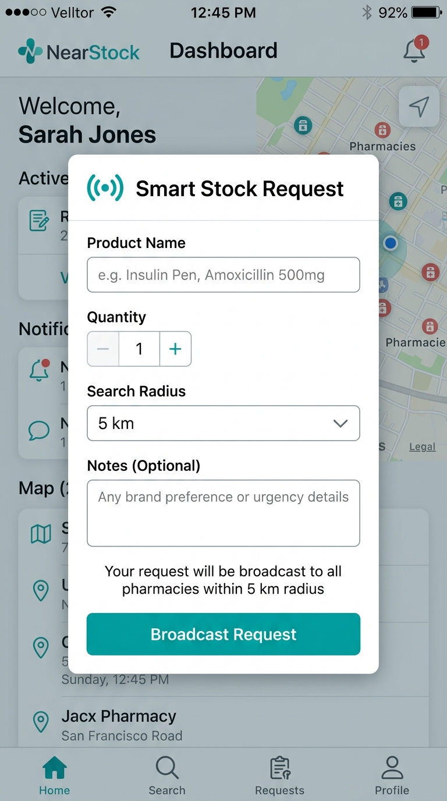

# NearStock — Find it nearby. Reserve it. Get it.

<p align="center">
  
</p>

<p align="center">
  <b>Local inventory discovery and instant pickup reservation platform</b><br/>
  <i>Pharmacies • Retail • Medical Supplies • General Stores</i>
</p>

---

## Problem Statement

Customers often face the frustration of traveling to pharmacies or retail stores only to discover that the product they need is **out of stock**. There is no reliable, real-time way for consumers to check local store inventory before making the trip — especially for urgent items like medicines, medical devices, and first-aid supplies.

On the merchant side, local store owners have no digital tool to **broadcast their inventory** to nearby customers, manage **pickup reservations**, or respond to **customer demand signals** for specific products.

## Project Description

**NearStock** is a mobile-first Progressive Web App (PWA) that bridges the gap between local store inventory and nearby customers. It provides:

- **🔍 Real-time local inventory search** — Customers search for products and see which nearby stores (within a configurable radius up to 100 km) have them in stock, sorted by distance, price, or availability.
- **📍 Google Maps integration** — Interactive map view showing nearby pharmacies/stores with location pins and radius visualization.
- **🛒 Instant pickup reservation** — Customers can reserve in-stock items with a unique pickup code (e.g., `NS-8924`), choose 60-min or 120-min pickup windows, and pay a small reservation fee (1% of product price) via QR/UPI.
- **📡 Smart Stock Request** — When a product isn't found locally, customers broadcast a "Smart Stock Request" to all pharmacies or other stores within their search radius. Merchants can respond with offers, and customers can accept and reserve.
- **🏪 Merchant dashboard** — Store owners manage inventory, track live pickup bookings, update stock in real time, configure store profiles, and respond to stock requests.
- **🔐 Admin panel** — Full admin oversight for merchant application approvals, platform monitoring, and user management.
- **🔔 Real-time notifications** — In-app notification system for reservation status updates, stock request matches, and merchant alerts.

---

## Google AI Usage

### Tools / Models Used

- **Google Maps Platform** — Maps JavaScript API, Places API, Geocoding API for interactive store maps, location autocomplete, distance calculations, and radius-based search
- **Firebase (by Google)** — Authentication (Email/Password), Cloud Firestore (real-time database), Firebase Storage (product images & documents), Firebase Admin SDK (server-side operations)
- **Google Fonts** — Inter typeface for modern, accessible typography
- **Gemini (Google AI)** — Used during development for code generation, architecture design, and debugging assistance

## Tech Stack Used

- **Frontend:** Next.js 14 (App Router), React 18, TypeScript
- **Styling:** Tailwind CSS 3.x, Framer Motion (animations)
- **UI Components:** Radix UI (Dialog, Dropdown, Select, Tabs), Lucide React (icons)
- **Backend/Database:** Firebase Cloud Firestore (real-time NoSQL), Supabase (supplementary storage)
- **Authentication:** Firebase Auth (Email/Password with role-based access)
- **Maps:** Google Maps JavaScript API via `@vis.gl/react-google-maps`
- **Forms:** React Hook Form + Zod (schema validation)
- **Deployment:** Vercel
- **Date Handling:** date-fns

### How Google AI Was Used

Google AI services are deeply integrated across the platform:

1. **Google Maps Platform** powers the core location features:
   - Interactive map view with store markers and user location
   - Radius-based search visualization (1 km to 100 km)
   - Google Places Autocomplete for location onboarding and address inputs
   - Distance calculation (Haversine formula + Google Maps API) between user and stores
   - Parsing coordinates from Google Maps links for merchant store registration

2. **Firebase (Google Cloud)** provides the real-time backend:
   - Cloud Firestore real-time listeners (`onSnapshot`) for live inventory updates, reservation status, and notifications
   - Firebase Auth handles multi-role authentication (Customer, Merchant, Admin) with session persistence
   - Firebase Storage manages product images and merchant verification documents (drug licenses)
   - Firebase Admin SDK performs server-side operations via Next.js API routes

3. **Gemini AI** was used during the development process for:
   - Generating component architectures and responsive UI layouts
   - Debugging complex state management in the reservation and stock request flows
   - Writing and optimizing Firestore security rules and queries

---

### GitHub Repo Link of the Project

[NearStock GitHub Repository](https://github.com/github_user_name/repo_name)

## Proof of Google AI Usage

Proofs of Google AI usage (API key configurations, Firebase console screenshots, Maps API integration evidence) are included in the [`/proofs`](proofs/) folder.

---

## Screenshots

### 1. Welcome / Landing Page
The entry point of NearStock — a clean, branded welcome screen with Sign Up and Login options.

<p align="center">
  
</p>

---

### 2. Customer Dashboard
The main customer hub showing live stats (nearby stores, available products, active reservations, search radius), a search bar with the "Pharmacy Network Live" indicator, category filters, and featured nearby products.

<p align="center">
  
</p>

---

### 3. Product Search & Filters
Advanced search with real-time filtering — sort by distance/price/availability, toggle "In Stock Only", adjust search radius (1–100 km), and switch between List and Map views.

<p align="center">
  
</p>

---

### 4. Reservation Flow & QR Payment
Complete reservation workflow showing product details, quantity selection, duration options (60 min free / 120 min ₹10), transparent fee breakdown (1% reservation fee), and QR-based UPI payment.

<p align="center">
  
</p>

---

### 5. Merchant Dashboard
Store owner's command center with real-time metrics (total products, stock units, low stock alerts, out of stock count), active pickup bookings with customer details and pickup codes, and quick action buttons.

<p align="center">
  
</p>

---

### 6. Smart Stock Request
When a product isn't found nearby, customers can broadcast a Smart Stock Request to all pharmacies within their search radius. Merchants receive notifications and can respond with offers.

<p align="center">
  
</p>

---

## Demo Video

Upload your demo video to Google Drive and paste the shareable link here (max 3 minutes). [Watch Demo](https://drive.google.com/drive/u/0/folders/1ne0pzHszJRczkWNzWcY5leQVOlGkJZU4)

---

## Key Features

| Feature | Description |
|---|---|
| **Multi-Role Auth** | Customer, Merchant, and Admin roles with Firebase Auth |
| **Location Onboarding** | Google Places Autocomplete for setting pickup location |
| **Radius Search (1–100 km)** | Configurable search radius with real-time product filtering |
| **Map + List Views** | Toggle between interactive Google Map and product list |
| **Instant Reservation** | Reserve products with pickup code, 60/120 min window |
| **QR/UPI Payment** | Pay reservation fee (1% of product price) via QR code |
| **Smart Stock Request** | Broadcast product requests to nearby pharmacies |
| **Merchant Inventory** | Add/edit products, manage stock, upload images |
| **Pickup Bookings** | Merchants manage pickup confirmations and completions |
| **Real-time Updates** | Firestore `onSnapshot` listeners for live data |
| **Admin Panel** | Approve/reject merchant applications, manage platform |
| **Prescription Support** | Document upload and verification for Rx products |
| **Notifications** | In-app alerts for reservation status and stock matches |
| **Saved Stores** | Bookmark favorite pharmacies for quick access |

---

## Architecture

```
NearStock/
├── app/                    # Next.js 14 App Router
│   ├── (auth)/             # Login, Signup, Forgot Password
│   ├── admin/              # Admin dashboard & management
│   ├── api/                # API routes (auth, maps, products, reservations, stores, stock-requests, seed)
│   ├── dashboard/          # Customer dashboard
│   ├── merchant/           # Merchant dashboard, inventory, orders, settings, store profile
│   ├── onboarding/         # Location setup & search radius
│   ├── product/            # Product detail pages
│   ├── profile/            # User profile management
│   ├── reservations/       # Customer reservation history
│   ├── reserve/            # Reservation flow (per product)
│   ├── saved-stores/       # Bookmarked stores
│   ├── search/             # Product search with map/list views
│   ├── stock-requests/     # Smart Stock Request management
│   └── notifications/      # Notification center
├── components/
│   ├── customer/           # ProductCard, StoreCard, ReservationCard, StockRequestModal
│   ├── layout/             # MobileFrame, navigation components
│   ├── maps/               # GoogleMapContainer, LocationAutocomplete
│   └── ui/                 # Button, Input, Badge, Card, Dialog, Logo, Tabs
├── lib/
│   ├── firebase/           # Firebase client & services (auth, Firestore, storage)
│   ├── supabase/           # Supabase client configuration
│   ├── store.tsx           # Global app state (React Context + Firebase real-time listeners)
│   ├── types.ts            # TypeScript interfaces (UserProfile, Store, Product, Reservation, etc.)
│   └── utils.ts            # Haversine distance, fee calculation, formatting utilities
├── public/                 # Static assets (logo, favicon)
├── scripts/                # Database seed script
└── screenshots/            # Project screenshots
```

---

## Installation Steps

### Prerequisites

- **Node.js** >= 18.x
- **npm** >= 9.x
- A **Firebase** project with Firestore, Auth, and Storage enabled
- A **Google Maps API key** with Maps JavaScript API, Places API, and Geocoding API enabled
- (Optional) A **Supabase** project for supplementary storage

### Setup

1. **Clone the repository:**
   ```bash
   git clone https://github.com/github_user_name/repo_name.git
   cd NearStock
   ```

2. **Install dependencies:**
   ```bash
   npm install
   ```

3. **Configure environment variables:**

   Copy `.env.example` to `.env.local` and fill in your credentials:
   ```bash
   cp .env.example .env.local
   ```

   Required variables:
   ```env
   # Firebase Client
   NEXT_PUBLIC_FIREBASE_API_KEY=your_firebase_api_key
   NEXT_PUBLIC_FIREBASE_AUTH_DOMAIN=your_project.firebaseapp.com
   NEXT_PUBLIC_FIREBASE_PROJECT_ID=your_project_id
   NEXT_PUBLIC_FIREBASE_STORAGE_BUCKET=your_project.appspot.com
   NEXT_PUBLIC_FIREBASE_MESSAGING_SENDER_ID=your_sender_id
   NEXT_PUBLIC_FIREBASE_APP_ID=your_app_id

   # Firebase Admin (Server-side)
   FIREBASE_PROJECT_ID=your_project_id
   FIREBASE_CLIENT_EMAIL=your_service_account_email
   FIREBASE_PRIVATE_KEY=your_private_key

   # Supabase (Optional)
   NEXT_PUBLIC_SUPABASE_URL=your_supabase_url
   NEXT_PUBLIC_SUPABASE_ANON_KEY=your_supabase_anon_key

   # Google Maps
   NEXT_PUBLIC_GOOGLE_MAPS_API_KEY=your_google_maps_api_key
   GOOGLE_MAPS_SERVER_API_KEY=your_google_maps_server_key
   ```

4. **Seed the database (optional):**
   ```bash
   npm run seed
   ```

5. **Run the development server:**
   ```bash
   npm run dev
   ```

6. **Open the app:**
   Navigate to [http://localhost:3000](http://localhost:3000)

### Production Build

```bash
npm run build
npm start
```

### Deploy to Vercel

```bash
npx vercel --prod
```

---

## Team

Built with ❤️ by the **NearStock Team**

---

## License

This project was built for a hackathon / competition submission. All rights reserved.
